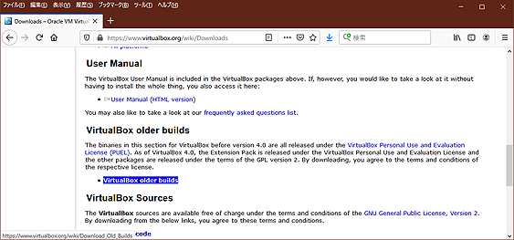

# P2V 悪戦苦闘
---
7/23/2020 作成

CentOS5を題材に、運用中の物理マシンのLinuxを無事に Hyper-V のVHDXに変換するまでの奮戦記。

---

## 課題
md-mirrorの片側RAID-DISKが故障して、起動不能になったCentOS5.11/i386マシンイメージを、この機会にデータや設定、プログラムバイナリーをそのまま、Hyper-Vの仮想DISKのゲストOSとしてWindows Server上に載せ替え、元あった通りに運用する。

たったこれだけの事。半日程度で完了させるつもりだったが、実に様々なトラブルに遭遇し、予想に反して5日もかかってしまったので、忘れる前に自分用のメモとしてまとめておく。ネット上には、似たような情報すら無く結構大変だった。

なぜ今時こんな事をする必要があるのか？なぜ片側RAID-DISKが故障しただけで起動不能になったのか？諸般の事情が多数あるが、それらは置いておき、表立った主な理由は次の通りである。

1. 運用中データ＆環境の完全保全
2. 今後のメンテナンス性の向上
3. 復旧作業時間の最短化
4. 同種作業のノウハウ蓄積

この様な目標だった。結果としては、3.を除いて達成できた。以下、調べた事や試して失敗した事は最低限として、作業を成功させる方法とポイントやハマり処を示す。なお実際にP2Vで移行したデータは、60GB程度だった。

## 手順とツール

全体の手順は次の通り。

1. データの保全と吸出し
2. 仮想DISKイメージ変換前処理
3. 仮想DISKイメージへの変換（作成）
4. 起動用仮想DISKの作成
5. 運用環境の作成

使用したツールや環境は次の通り。

- [MiniTool Partition Wizard 9.1 Free edition](https://www.partitionwizard.com/free-partition-manager.html)
- GParted https://gparted.org/
- [これのUSB化](https://github.com/ahidaka/LinuxDevelopersGuide/blob/master/GParted-usb.md)
- CentOS5.11インストールDVD 1/2, 2/2
<br/><br/>
- バックアップや作業用の空のDISK数個（SSDが望ましい）
- ターゲットホストのWindows 10またはWindows Server
- 元の、または空いているCentOS 5.11/i386インストール可能マシン
- 起動VHDX作成用の Windows 8.1 または Windows Server 2016 以前のマシン

## データの保全と吸出し

DISK丸ごとを保存、コピーするツールは少ない。DISKドライブ関係は何でもできるはずのGPartedは、最新版でもDISK丸ごとバックアップ・コピーには対応していない。そこでドライブコピーが可能だった手持ちツールのPartition Wizard 9.1を使用して、まずは生き残ったドライブ内容を別DISKにバックアップした。途中で気付いたが、200GB程度の作業用のSSDがいくつかあると作業が速くなる。

なお CentOS5 の md 0.90 のメタデータ（管理データ）はパーティション内の最後にあるため、パーティションタイプを変更しなくても、ext3でマウントして参照できる。生き残った方のドライブをfsckと目視で壊れてないか一応内容を確認した。なお後日談だが、故障したと思っていた方のドライブも、SMARTでのエラーは一切無かった。

### 復旧時トラブルと対応

確認用と万が一のために作業ターゲットと同じCentOS5.11/i386を、物理DISKに新規インストールして作成した。不要だったかも知れないが、後述の/dev復旧時のリファレンスとして役立った。以下は、生き残ったドライブ（/dev/sdb＝コピー側）単体で起動させて動作確認するまでの手順とトラブルである。

- パーティションタイプ変更はfdiskでtypeをFDから83(linux data)または82(swap)に変更。

- メタデータを削除するmdadm -zero-superblockがなぜかエラーになる。気持ち悪いが無視することにした。

- 原因不明だが生き残ったDISKの /dev/以下が空だった。これにより生き残ったDISKのコピーイメージにgrub-installしても、起動しなかった。元のシステムが起動しなくなったのも、これが原因かもしれない。この問題が無ければ起動するはず。

	mknodコマンド手作業で/dev以下を作っていられないため、cpioで新規インストールのCentOSから/dev以下をコピー。ただし /dev以下はサブディレクトリにもデバイスノードがあるため、必ず次の様に **cpio** でコピーすること。

```sh
find . | cpio
```

- grub-installの方法（必ずCentOS 5.11 インストールCD使用）

	他のドライブで起動したLinux から実行する、複数ドライブを使用した grub-install ではどうやっても正常起動しない。（昔はできたはずだが）仕方なく DVDからレスキューモードで起動して grub-install を実行したところ、問題無く起動する様になった。

### ポイント：LinuxにおけるgrubによるMBRの修復方法

レスキューモード(F5)で立ち上げて、下記を実行。

```sh
# chroot /mnt/sysimage/
# grub-install /dev/sda
```

- 参考サイト

	https://adsaria.hatenadiary.org/entry/20080820/1219242110

fdiskでtypeを変更し、/dev以下をコピーして grub-installが正常終了した後は、シングルDISKで正常起動して、全環境が正常動作している事を確認する。P2Vをしないなら、これで復旧作業は完了。３時間程度だっただろうか。好みで、再びmd-raid化しても良い。しかしこのままのパーティション状況では、P2V化しても多分動作しない。

次項から、現在正常動作している環境をP2Vする方法を説明する。

## 仮想DISKイメージ変換前処理

試行錯誤の結果、物理DISKを仮想DISK化するには単一パーティションにする必要があるらしい。複数パーティションをP2V可して正常動作させる方法は確認できなかった。DISKが複数パーティションあると、変換した時にパーティーション管理テーブル(この場合はMBR)のアライメントやブロック開始位置がずれる様子だ。従って swapパーティーションは削除してswapfile化する必要がある。

単一パーティション化の作業は次の通り。

- 不要なデータやパーティションの削除
- /dev/sda1を拡張（/dev/sda2以降は後方に移動）
- /dev/sda1に/dev/sda2以降の内容をコピー（cpio利用）
- swapパーティーションをswapfile化
- /etc/fstab 修正
- grub-insallの再実行（後で判明したが、結局ここでは起動出来ないので不要だった）

従ってやらなくても良いのだが、一応正常動作確認で、上記変更完了後、再起動して単一パーティションで正常動作を確認する。

パーティーションの移動とリサイズにはGPartedを使用する。このためだけに最新GParted環境を作ってられないので、この際なのでUSBブータブルな、GPartedを作成して使用した。

### [ポイント：USBブータブルGParted作成](https://github.com/ahidaka/LinuxDevelopersGuide/blob/master/GParted-usb.md)

- 参考ページ

	https://gparted.org/liveusb.php

	https://itneko.blogspot.com/2019/01/usbgparted-live.html

### [ポイント：cpio](https://github.com/ahidaka/LinuxDevelopersGuide/blob/master/cpio.md)


## 仮想DISKイメージへの変換（作成）

ddイメージの作成とVHD変換（作成）をLinux上で行う。

### ddイメージの作成

安定動作しているLinuxシステム（何でも良い）の /dev/sdb に前項で単一パーティション化としたドライブを接続し、ddイメージを作成する。

今回の作業では、DISKの後ろの方（パーティション）は使っていなかったため、仮想化するドライブの容量を少なくするため、全体仮想化の際DISK丸ごとを対象とするのではなく、前半部分だけを仮想化対象としたかった。

DISKドライブやパーティーションからVHD変換用イメージ（生データ）を作成するツールは何種類かあるらしいが、イメージ作成時にサイズ指定ができるのは、多分 **dd** の方法だけの様子。先頭から64GB分をddイメージ化するコマンドは次の通り。sdaもsdbもSSDにしておくと速い。

```sh
# dd if=/dev/sdb bs=4k conv=noerror,sync of=myfile.dd count=16093114
```

### VHD変換・作成

公開されている VirtualBox 利用してddイメージをVHDに変換する。今回の作業ホストは、ターゲットに合わせて前述の新規インストールした CentOS5.11(i386) を使用した。VirtualBoxの最新版は当然ながらx86_64だけの対応のため、VirtualBoxのサイトで、適当に古い4.3.40 のi386版を指定して入手、インストール。インストール先もCentOS5.11として、そのCentOS5.11上で次の通り、インストールした **VBoxManage** コマンドを使用して変換した。 

```sh
# VBoxManage convertfromraw myfile.dd myfile.vhd --format VHD
```

#### VirtualBox 4.3.40 の入手

VirtualBox Download ページで、**VirtualBox older buiulds** を選択。


##### VirtualBox Download ページ<br/>
https://www.virtualbox.org/wiki/Downloads

**VirtualBox 4.3 (no longer supported, support ended 2015/12)**<br/>
を選択して進み、<br/>
**Oracle Linux 5 ("OL5") / Red Hat Enterprise Linux 5 ("RHEL5") / CentOS 5 i386**<br/>
をダウンロード 


##### Download VirtualBox (Old Builds): VirtualBox 4.3 ページ<br/>

https://www.virtualbox.org/wiki/Download_Old_Builds_4_3

#### 参考サイト（英語）
https://superuser.com/questions/410940/how-to-create-vhd-disk-image-from-a-linux-live-system

#### 参考サイト（日本語）
https://qastack.jp/superuser/410940/how-to-create-vhd-disk-image-from-a-linux-live-system

## 起動用仮想DISKの作成

単一パーティションで作成したVHDXファイルは、他の仮想化したLinuxVMから参照することができても、そのままではどうやってもそれ自体、単体で起動する事はできない。どうやら Hyper-V での起動ドライブのMBRには、特別な設定が必要らしい。

仕方なく新規で起動用のOS(CentOS5.11)を新たに仮想マシンにインストール、仮想DISKとして作成し、それをブートストラップにして、別VHDXの本家イメージを誘導することにする。SSDの方が高速に進む。ホスト側マシンも速い方が良いだろう。重要な事は、この古い CentOS5.11 が比較的新しいHyper-V環境で起動し、安定動作する事を確認することだ。この一見単純なインストール作業が、実に何回もトラブルが発生し、再インストールが何回も必要だったので非常に注意が必要だ。ここで作成する起動用のCentOS5.11の仮想DISKサイズは30GBとした。

ここで新規インストールする起動用のCentOS5.11もパーティションは切らずに、カスタムパーティションを作成で単一パーティションとする。swapパーティション作成を推奨するメッセージが出るが、インストールの際は無視し、インストール完了後にswapfileを作成してfstabを書き換える。

### ポイント:swapfile

8192GBのswapfileの作成と設定
```sh
# dd if=/dev/zero of=swapfile bs=1M count=8192
# mkswap swapfile
# chmod 600 swapfile
```

fstabの内容

```sh
# cat /etc/fstab
... (省略) ...
/swapfile           swap               swap    defaults        0 0
```

https://centos.bungu-do.jp/archives/65


### ポイント・ハマり処

― Windows 10は使えずWindows 8.1が必要

CentOS5.11/i386のインストールDVDは、（割と最近の？）Windows 10 の Hyper-V では起動しない。正確には、起動しているらしいがキーボード入力ができない。作業の目的は CentOS5.11/i386 が起動するVHDX仮想DISKファイルを作成することである。従ってこの作業はやや古い、しかし安定動作しているWindows 8.1やWindows Server 2016等で行う必要がある。Windows Server 2019で起動するかどうかは試していない。

- Windows 10 等の仮想DISKのチェックポイント

	Windows 10や最近のWindows Server　の仮想DISKのチェックポイントはデフォルトで自動設定になっている。チェックポイントがあるとVHDXをコピーできないので、手動にして全チェックポイントを削除しておく。Windows 8.1等では必要ない。

## 運用環境の作成

起動＆安定動作する空の仮想DISKが作成できて、安定動作確認済みのイメージの単一パーティション化したVHDXが用意してあれば、後はこれらを組み合わせるだけである。OSのバージョン、/boot 以下の内容と配置、/lib/modules以下のローダブルモジュールに注意。

Hyper-Vのリソース管理については、特に記していない。メモリー、動的、DISK、CPU数など適宜設定して良い。

以上