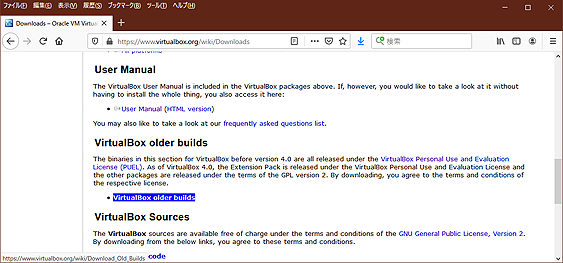
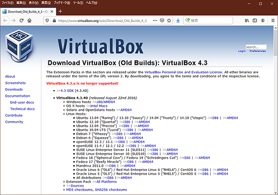

# hard Fighting of P2V
---
3/10/2021 Translated

Based on CentOS 5, the fighting story of successfully converting Linux on a physical machine in operation to VHDX of Hyper-V.

---

## Subject
One side RAID-DISK of md-mirror on an old CentOS 5.11 / i386 machine failed and became unbootable. I took this opportunity to replace it as a guest OS on a Hyper-V virtual DISK on a Windows Server, with the data, settings, and program binaries intact, and run it as it was before.

That's all there is to it. I had planned to complete it in about half a day, but I encountered various troubles, and it took five days against my expectation, so I'm writing it down as a memo for myself before I forget. There was no similar information on the Internet, and it was quite difficult.

Why do I need to do this nowadays? Why did it become impossible to start just because one side RAID-DISK failed?
There are many reasons, but I'll leave those aside and the main reasons that stand out are as follows.

1. complete preservation of data and environment during operation
2. improved maintainability in the future
3. minimizing the recovery time
4. accumulation of know-how for similar work

These were the goals of the project. As a result, we were able to achieve all of them except for **#3**.  In the following, I will show you how to successfully complete the work and the points and points of failure, while keeping the things I researched and tried unsuccessfully to a minimum. In addition, the actual data migrated by P2V was about 60GB.

Translated with www.DeepL.com/Translator (free version)

## Procedure and Tools

The overall steps are as follows:

1. Data preservation and sucking out
2. Preprocess for virtual DISK image conversion
3. Convert to virtual DISK image (creation)
4. Create virtual DISK for startup.
5. Create of operating environment

The tools and environment used were as follows.

- [MiniTool Partition Wizard 9.1 Free edition](https://www.partitionwizard.com/free-partition-manager.html)
- GParted https://gparted.org/
- [これのUSB化](https://github.com/ahidaka/LinuxDevelopersGuide/blob/master/GParted-usb.md)
- CentOS 5.11インストールDVD 1/2, 2/2
<br/><br/>
- Some empty DISKs for backup and work (SSD is recomended)
- Windows 10 or Windows Server for the target host
- Original or free CentOS 5.11 / i386 installed machine
- Windows 8.1 or Windows Server 2016 or earlier machine for booting VHDX creation 

## Data preservation and sucking out

There are few tools that save and copy the whole DISK. GParted that should be able to do everything related to the DISK drive does not support the backup and copy of the whole DISK even in the latest version.

So I used Partition Wizard 9.1, one of the tools I had that could copy drives, and backed up the whole image of the surviving drive to another DISK. On the way, I noticed that having a couple of SSDs of about 200GB for work would speed up the process.

Note that the metadata (management data) of md 0.90 in CentOS 5 is located at the end of the partition, so it can be mounted and referenced using ext3 without changing the partition type. I checked the contents of the surviving drive with fsck and visually to see if it was damaged. As a side note, the drive that I thought had failed did not have any SMART errors at all.

### Trouble and Response of recovery 

For confirmation and just in case, CentOS 5.11/i386, the same as the work target, was newly installed on a physical DISK and created. It may have been unnecessary, but it was useful as a reference for the /dev recovery described below. The following is the procedure and trouble until I booted the surviving drive (/dev/sdb = copy side) alone and checked its operation.

- To change the partition type, use fdisk to change the type from FD to 83 (linux data) or 82 (swap).

- For some reason, mdadm -zero-superblock, which removes metadata, gives an error. It's weird, but I decided to ignore it.

- I don't know why, but the /dev/ of the surviving DISK was empty. As a result, even if I did a grub-install on a copy image of the surviving DISK, it would not boot. This may have been the reason why the original system stopped booting. If this problem is not there, it should boot.

	Since I couldn't create /dev manually with the mknod command, I used cpio to copy /dev from the newly installed CentOS. However, since there are device nodes in subdirectories under /dev, be sure to copy them with **cpio** as follows.

```sh
# find . | cpio
```

- How to install grub (be sure to use the CentOS 5.11 installation CD)

	No matter how I try to do a grub-install using multiple drives, running from Linux booted on another drive, it does not boot properly.
	I thought I could do it in the past, but I decided to give up. I had no choice but to boot from a DVD in rescue mode and run grub-install, and it booted without any problems.

### Point: How to repair MBR with grub of Linux

Start up in rescue mode (F5) and execute the following.

```sh
# chroot /mnt/sysimage/
# grub-install /dev/sda
```

If you don't use P2V, the recovery process is complete. If you prefer, you can md-raid it again. However, in this partition situation, P2V will probably not work.

In the next section, we will explain how to P2V an environment that is currently working properly.

## Virtual DISK image conversion pre-processing

As a result of trial and error, it seems that in order to turn a physical DISK into a virtual DISK, it needs to be a single partition.
I was not able to find a way to make multiple partitions work properly by converting them to P2V.
If there are multiple partitions on the DISK, the alignment and block start position in the partition management table (MBR in this case) will shift when converted.
Therefore, it is necessary to delete the swap partition and convert it to a swapfile.

The process of single partitioning is as follows

- Delete unnecessary data and partitions.
- Extend /dev/sda1 (move /dev/sda2 and later to the back)
- Copy the contents of /dev/sda2 and later to /dev/sda1 (using cpio)
- Turn swap partitions into swapfile
- Modify /etc/fstab
- Rerun grub-insall (as it turned out later, it was not necessary since it was not possible to boot here after all)

For the purpose of confirming normal operation, reboot just in case after the above changes are completed, and confirm normal operation with a single partition.

Use GParted to move and resize the partitions. Since I don't have time to create the latest GParted environment just for this purpose, I created a USB bootable GParted and used it.

### [Point: Create USB bootable GParted](https://github.com/ahidaka/LinuxDevelopersGuide/blob/master/GParted-usb.md)

- Reference page

	https://gparted.org/liveusb.php

	https://itneko.blogspot.com/2019/01/usbgparted-live.html

### [Point: cpio](https://github.com/ahidaka/LinuxDevelopersGuide/blob/master/cpio.md)


## Convert to virtual DISK image (create)

Create a dd image and perform VHD conversion (creation) on Linux.

### Creating a dd image

Connect the single partitioned drive in the previous section to /dev/sdb on a stable Linux system (anything is fine) and create a dd image.

Since we were not using the back part of the DISK (partition), we wanted to virtualize only the first half of the DISK instead of the entire DISK in order to reduce the capacity of the drive to be virtualized.

I heard that there are several tools for creating images (raw data) for VHD conversion from DISK drives and partitions, but the only one that allows you to specify the size at the time of image creation is probably the **dd** method. The command to make a dd image of 64GB from the top is as follows. sda and sdb are both SSD, so it's faster.

```sh
# dd if=/dev/sdb bs=4k conv=noerror,sync of=myfile.dd count=16093114
```

### VHD conversion and creation

Convert the dd image to a VHD using the public VirtualBox. This time, I used the newly installed CentOS5.11 (i386) for the target host, and since the latest version of VirtualBox only supports x86_64, I went to the VirtualBox site and got the old 4.3.40 i386 version.
Then, install it. The installation destination was also CentOS 5.11, and the conversion was done on CentOS 5.11 using the installed **VBoxManage** command as follows. 


```sh
# VBoxManage convertfromraw myfile.dd myfile.vhd --format VHD
```

#### Obtain VirtualBox 4.3.40

On the VirtualBox Download page, select **VirtualBox older buiulds**.


##### VirtualBox Download page<br/>
https://www.virtualbox.org/wiki/Downloads

Select
**VirtualBox 4.3 (no longer supported, support ended 2015/12)**<br/>
to proceed, and download
**Oracle Linux 5 ("OL5") / Red Hat Enterprise Linux 5 ("RHEL5") / CentOS 5 i386**.<br/>


##### Download VirtualBox (Old Builds): VirtualBox 4.3 ページ<br/>

https://www.virtualbox.org/wiki/Download_Old_Builds_4_3

#### Reference page
https://superuser.com/questions/410940/how-to-create-vhd-disk-image-from-a-linux-live-system

## Create a virtual DISK for booting

Even though the VHDX file created on a single partition can be referenced by other virtualized Linux VMs, it cannot be booted by itself by any means. Apparently, the MBR of the boot drive in Hyper-V requires a special configuration.

The SSD is faster. The SSD will be faster, and the host machine should be faster as well. The important thing is to make sure that this old CentOS 5.11 will boot and run stably in the relatively new Hyper-V environment. This seemingly simple installation process caused a lot of trouble and required many reinstallations, so be very careful. The virtual disk size of the CentOS 5.11 bootstrap to be created here was set to 30GB.

The new CentOS 5.11 boot partition to be installed here will not be partitioned, but a custom partition will be created to make it a single partition. Create a swapfile and rewrite the fstab.

### point:swapfile

Create and configure an 8192GB swapfile.

```sh
# dd if=/dev/zero of=swapfile bs=1M count=8192
# mkswap swapfile
# chmod 600 swapfile
```

Contents of fstab

```sh
# cat /etc/fstab
... (Ommited) ...
/swapfile           swap               swap    defaults        0 0
```

### Points and cautions

- Windows 10 is not available, Windows 8.1 is required.

The CentOS 5.11/i386 installation DVD is (relatively?) recent. Windows 10 Hyper-V will not boot. To be precise, it seems to boot, but keyboard input is not possible. The purpose of the work is to create a VHDX virtual DISK file that will boot CentOS5.11/i386. I haven't tried whether it boots on Windows Server 2019 or not.

- Checkpoints for Windows 10 and other virtual DISKs

	Checkpointing of the virtual DISK in Windows 10 and recent Windows Servers is set to automatic by default. This is not necessary for Windows 8.1 and other operating systems.

## Create an operational environment

Once you have created an empty virtual disk that can boot and run stably, and a single partitioned VHDX with a confirmed stable image, all you need to do is combine them. Note the OS version, contents and placement of /boot, and loadable modules in /lib/modules.

The resource management of Hyper-V is not specifically described. You can set the memory, dynamic, DISK, number of CPUs, etc. as needed.

That's all.
